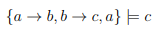
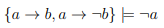
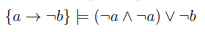
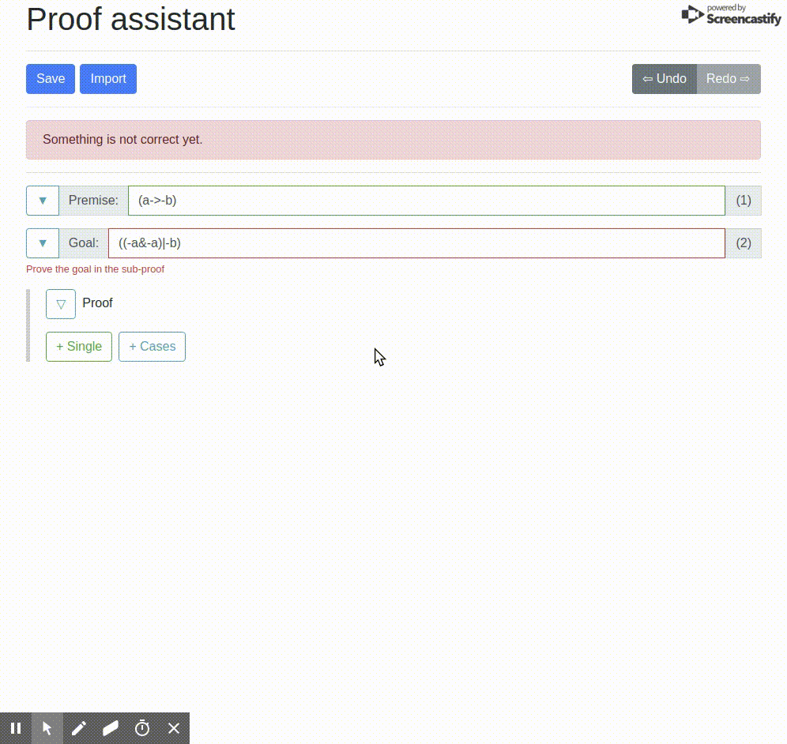
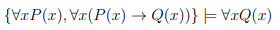
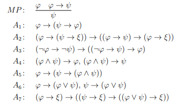
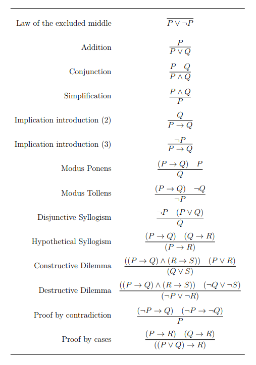
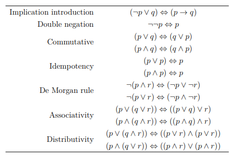

# User guide for the proof assistant

This guide shows the power of the proof assistant. Section 1 shows information how to enter formulas to the assistant.  Section 2 shows example assignments with solutions. Section 3 describes the implemented rules known to the assistant.

## Section 1
To enter a set of formulas to the proof assistant, enter each formalized formula to a separate line. The assistant has one unary operator `-` (negation) and three binary operators `&` (and), `|` (or), `->` (implication). Each formula with a binary operator must be inside parentheses. So instead of `a & b` one must write `(a & b)`.

First order formulas can be written as `\forall x P(x)` or `\exists x P(x)` notice the space between `x` and `P`.

Examples of a good formulas:
```
p
(p->q)
((p|q)&-r)
(\forall x P(x) -> - \exists x R(x))
```

Examples of bad formulas:
```
p->q
((p|q)&-r
\forall xP(x)            <--- Notice: This formula can be parsed but means for all "xP" in formula "x"
```

---

## Section 2
These four examples present the capabilities of the proof assistent.

### Example 1
Assignment: 



Solution:


### Example 2
Assignment: 



Solution:


### Example 3
Assignment: 



Solution:



### Example 4
Assignment: 


Solution:


---

## Section 3

The proof assistant is based on a hybrid formal system mixing Hilbert calculus and Sequent calculus. That means the following axioms and modus ponens are implemented and the proof assistant can identify them.



To simplify the use of the proof assistant we implement additional sound rules of inference. These rules are shown bellow.



The proof assistants also knows the following rules derived from equivalences




